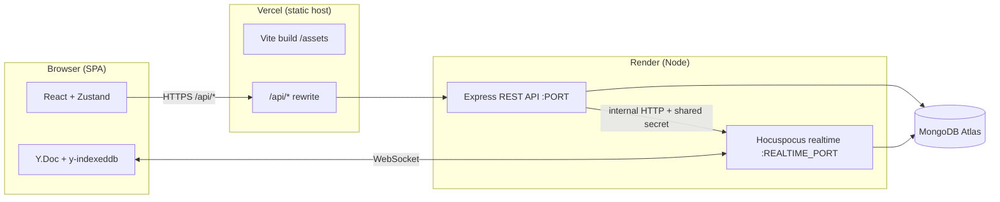
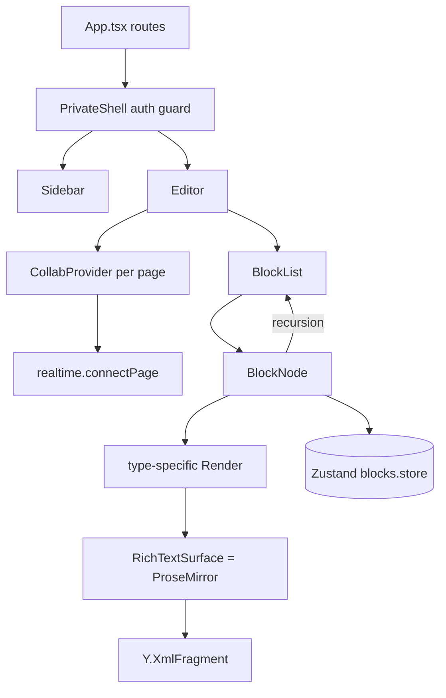
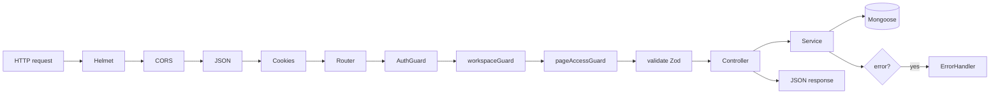
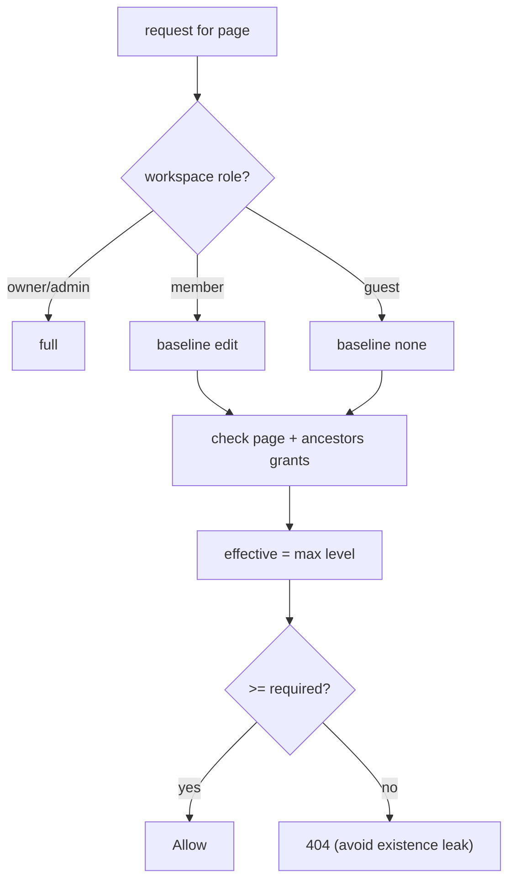

# 01 — Architecture

## 1. Overall system architecture [Confirmed]

Three deployables + a database:



**Key facts:**
- The SPA is served as static files from Vercel. All `/api/*` calls are **rewritten** by
  `client/vercel.json` to the Render API — so the browser only ever talks to one origin
  (same-site), which is why the httpOnly refresh cookie survives reloads.
- **REST API** and **realtime (Hocuspocus)** are **separate processes** (and, on Render,
  separate services / ports). The API pings realtime over an internal HTTP endpoint using a
  shared secret to broadcast "block list changed" beacons.
- **Both** the API and the realtime process talk to the **same MongoDB** (one owns relational
  block rows, the other owns Yjs snapshots/history).

---

## 2. Frontend architecture [Confirmed]

- **React 18 + TypeScript + Vite** SPA. Routing via `react-router-dom` v6 in `app/App.tsx`
  with **route-level code splitting** (`lazy()` + `Suspense`) and auth-gated shells.
- **State: Zustand** (11 stores) — no Redux. State is **normalized** for the editor
  (`byId` / `childrenOf` / `rootByPage`).
- **Editor: ProseMirror per block** + **Yjs** binding via `y-prosemirror`. A minimal
  inline-only PM schema (`pmSchema.ts`) — block structure is the React/Zustand tree, inline
  formatting is PM.
- **Services layer** (`services/*.ts`) wraps all network calls; `http.ts` centralizes auth
  headers, token refresh, and the `x-workspace-id` header; `realtime.ts` owns the Yjs/Hocuspocus
  lifecycle.



---

## 3. Backend architecture [Confirmed]

- **Express 4 + TypeScript**, run with **`tsx` at runtime** (no `tsc` build step — see
  `13-deployment-devops.md` for why).
- **Layered modules** under `modules/<feature>/`: `routes → controller → service → model`,
  with **Zod** schemas for validation.
- **Cross-cutting middleware**: `helmet`, `cors(credentials)`, `cookie-parser`,
  `express.json({limit:'2mb'})`, static uploads, then per-route guards
  (`authGuard`, `workspaceGuard`, `pageAccessGuard`, rate limiters, `validate`).
- **Central error handler** maps Zod/HttpError/Mongo-duplicate to proper status codes; a
  `notFound` catch-all returns JSON 404.
- **Startup side effects**: connect Mongo (`syncIndexes`), register an **account-deletion
  cascade** hook, and start a **Trash auto-purge** interval.



---

## 4. Database architecture [Confirmed]

- **MongoDB via Mongoose 8**, `strictQuery: true`, `syncIndexes()` on boot.
- **~15 collections** (see `04-database.md`). Multi-tenant boundary is the **workspace**:
  most documents carry a denormalized `workspaceId` so cross-workspace access can be rejected
  cheaply and queries stay workspace-scoped.
- **Blocks** use **client-generated string UUIDs** as `_id` (enables optimistic updates and
  idempotent upserts).
- **Rows** of inline databases live in a **sibling `DatabaseRow` collection** (not embedded)
  to avoid unbounded page documents.
- **Realtime persistence**: a `DocSnapshot` collection stores the encoded Yjs state per page;
  a `DocHistory` collection keeps throttled version snapshots for restore.

---

## 5. Communication between services [Confirmed]

| Channel | From → To | Transport | Auth |
|---|---|---|---|
| SPA data | Browser → API | HTTPS REST (via Vercel rewrite) | Bearer access JWT + httpOnly refresh cookie |
| Collab | Browser → realtime | WebSocket | access JWT in provider `token` |
| Beacon | API → realtime | internal HTTP `POST /__internal__/*` | `x-internal-secret` shared secret |
| Persistence | API + realtime → Mongo | Mongoose | connection string |

The **beacon** (`notify-blocks`, `restore`, `archive`) is how structural REST mutations reach
live editors: the realtime process bumps a `Y.Map('rev')` entry, every connected client sees a
Yjs update, and refetches its block list.

---

## 6. Authentication flow [Confirmed]

```mermaid
sequenceDiagram
    participant C as Client
    participant API as Express API
    participant DB as Mongo
    C->>API: POST /api/auth/login (email, pw, captcha)
    API->>DB: find user, bcrypt.compare (timing-safe)
    API->>DB: store SHA-256(refresh) + family + device
    API-->>C: Set-Cookie httpOnly refresh; body {accessToken, user}
    Note over C: accessToken in memory only
    C->>API: GET /api/... (Authorization: Bearer access)
    API-->>C: 401 when access expires
    C->>API: POST /api/auth/refresh (cookie)
    API->>DB: verify hash, detect reuse, rotate family
    API-->>C: new accessToken (+ rotated cookie)
```

Details in `05-auth-security.md`.

---

## 7. Authorization flow [Confirmed]

Two layers, resolved server-side:

1. **Workspace role** (`guest < member < admin < owner`) via `Membership` — `workspaceGuard`
   attaches `workspaceRole`; `requireCapability(cap)` enforces a capability matrix.
2. **Page level** (`none < view < comment < edit < full`) via `pageAccessGuard(level)` →
   `pagePermissionsService.resolve()`:
   - owner/admin → `full`; member baseline `edit`; guest baseline `none`;
   - explicit `PagePermission` grants on the page **or any ancestor** raise the level
     (inheritance — walk the parent chain, take the max), cached per request.
   - `publicShareGuard` handles anonymous token access separately.



---

## 8. Realtime architecture [Confirmed]

- One **Y.Doc per page** (`documentName = pageId`). Each block owns a `Y.XmlFragment`.
- Client: `y-indexeddb` (offline cache) + `HocuspocusProvider` (WebSocket) +
  `y-prosemirror` (bind fragment ↔ ProseMirror) + Yjs **Awareness** (presence/carets).
- Server: `onAuthenticate` verifies the JWT and resolves read-only vs read-write;
  `onStoreDocument` persists an encoded snapshot to Mongo (with a 5MB cap);
  history archive is throttled (≥60s between rows, keep 20). Full detail in `06-realtime.md`.

---

## 9. Deployment architecture [Confirmed]

- **Client → Vercel** (static SPA, `vite build`). `vercel.json` rewrites `/api/*` to the Render
  API and falls back to `index.html` for client routing.
- **Server → Render** as **two services**: API (`tsx src/index.ts`) and realtime
  (`tsx src/realtime/index.ts`).
- **DB → MongoDB Atlas.** Uploads → local disk on the API host (`sharp` pipeline).
- Env-var driven config (`env.ts`). See `13-deployment-devops.md`.

---

## 10. External services [Confirmed]

| Service | Purpose | Notes |
|---|---|---|
| MongoDB Atlas | Primary datastore | all collections + Yjs snapshots |
| Groq API | AI commands + autocomplete | OpenAI-compatible; SSE streaming; auto-disabled without key |
| Google OAuth 2.0 | Social login | server-side code exchange |
| Cloudflare Turnstile | Bot/captcha | gates signup/login/reset |
| Vercel | SPA hosting + API proxy | |
| Render | API + realtime hosting | |

---

## 11. Weaknesses & how an interviewer might probe them

For each: **why it exists → why it matters → likely question → improvement.**

### a. Single realtime instance / in-memory rooms
- **Why:** simplest correct implementation; Hocuspocus rooms live in one process's memory.
- **Matters:** you can't horizontally scale WebSockets without either sticky routing to the
  right room owner or a shared pub/sub, because two instances holding the same page's Y.Doc
  wouldn't share updates.
- **Question:** "How do you scale the realtime layer to N instances?"
- **Improvement:** add a Redis/`y-redis`-style backend or a Hocuspocus extension so any instance
  can serve any room; route by `documentName` hash with sticky sessions. See `10-scalability.md`.

### b. Two sources of truth (Mongo blocks vs Yjs text)
- **Why:** structural ops need queryable rows (sidebar, search, permissions); inline text needs a
  CRDT for conflict-free merge.
- **Matters:** they can drift; the `rev` beacon + debounced HTML serialization are the glue and a
  correctness risk area.
- **Question:** "What happens if the CRDT and Mongo disagree?"
- **Improvement:** treat Yjs as the authority for text and reconcile Mongo from `onStoreDocument`
  server-side (partially designed via snapshots); or move fully to CRDT + a projection.

### c. Local-disk uploads on Render
- **Why:** simplest storage driver; `storageDriver` already supports `s3` but it isn't wired.
- **Matters:** Render's filesystem is ephemeral — uploads can vanish on redeploy/restart.
- **Question:** "Where do user uploads live in production?"
- **Improvement:** enable the S3 driver + CDN; the abstraction already exists.

### d. Rate limiting behind a proxy
- **Why:** `express-rate-limit` keys on `req.ip`; behind Render's proxy the IP can be undefined.
- **Matters:** limiters can silently no-op → auth endpoints effectively unthrottled.
- **Question:** "Are your rate limits actually enforced in prod?"
- **Improvement:** `trust proxy` is set; use the `ipKeyGenerator` helper / key on
  `X-Forwarded-For`; verify with a load test.

### e. No CI pipeline / no server tests
- **Why:** solo project; Vercel/Render auto-deploy on push.
- **Matters:** no automated gate before prod; server logic (auth, permissions) is untested by
  automation.
- **Question:** "What stops a broken build reaching prod?"
- **Improvement:** GitHub Actions running `typecheck` + jest + a smoke test before deploy;
  add supertest integration tests for auth/permissions.

### f. In-memory OAuth state + rate-limit stores
- **Why:** single instance, simplest.
- **Matters:** breaks if the API is scaled to >1 instance (state won't be shared).
- **Improvement:** move to Redis.
