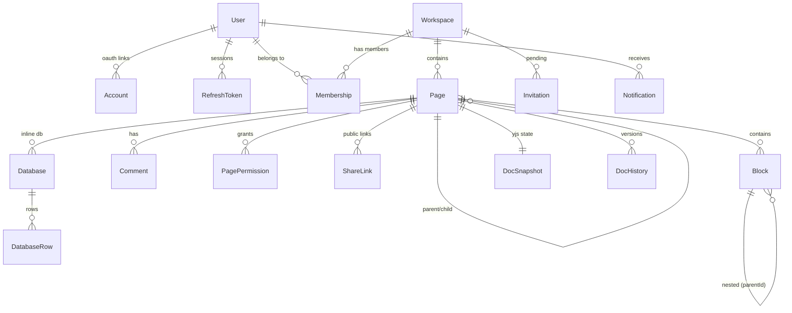

# 04 — Database Mastery

**MongoDB + Mongoose 8.** `strictQuery: true`; `syncIndexes()` on boot. Tenancy boundary is the
**workspace** — most collections carry a denormalized `workspaceId`.

---

## 1. Entities / models [Confirmed]

**Main app (15):** User, Account, RefreshToken, VerificationToken, Workspace, Membership, Page,
Block, Comment, Notification, PagePermission, Invitation, ShareLink, Database, DatabaseRow.
**Realtime (2):** DocSnapshot, DocHistory. → **17 collections total.**

> Resume says "11+ data models" — **accurate and conservative** (actual is 15–17).

## 2. ER diagram (key relationships) [Confirmed]

## 3. Schema design & indexes [Confirmed]

Highlights (fields abbreviated; see `03-backend.md` for full lists):

| Collection | Notable fields | Key indexes | Design note |
|---|---|---|---|
| **User** | email(unique,lower), passwordHash(nullable), username(partial-unique), role, tokenVersion, deletedAt | `{email}`, partial-unique `{username}` | `passwordHash` nullable ⇒ OAuth-only users; `tokenVersion` invalidates JWTs |
| **RefreshToken** | tokenHash(unique), family, replacedBy, revokedAt, ip, userAgent, expiresAt | unique `{tokenHash}`, `{family}`, **TTL** `{expiresAt}` | Only the hash is stored; family enables rotation + reuse detection; TTL auto-expires |
| **VerificationToken** | purpose(enum), tokenHash(unique), consumedAt, expiresAt | unique `{tokenHash}`, **TTL** | Single-use via `consumedAt` |
| **Workspace** | slug(unique), kind(personal/team), createdBy, archivedAt | `{slug}`, `{kind}`, `{createdBy}` | personal is 1:1 with user |
| **Membership** | userId, workspaceId, role(owner/admin/member/guest) | **compound-unique** `{userId,workspaceId}`, `{workspaceId,role}` | hot path `findOne({userId,workspaceId})` |
| **Page** | workspaceId, parentId(nullable), order, archivedAt, isTemplate, favorite, layout flags | `{workspaceId,parentId,order}`, `{workspaceId,archivedAt}` | sidebar tree query hits the compound index |
| **Block** | `_id`=UUID(string), workspaceId, pageId, parentId(string), type(enum ~23), text(HTML), order, props(Mixed) | `{pageId,parentId,order}`, `{workspaceId,pageId}` | client-generated id ⇒ optimistic + idempotent upsert |
| **Comment** | pageId, blockId, parentId, authorId, body, resolved, reactions[], deletedAt | `{pageId,blockId,createdAt}` | one-level threads; soft delete |
| **Notification** | userId, actorId, type, pageId, commentId, read | `{userId,workspaceId,createdAt:-1}` | denormalized for deep-linking without joins |
| **PagePermission** | pageId, userId, level(enum), grantedBy | **compound-unique** `{pageId,userId}` | sparse — most pages have zero rows |
| **Invitation** | workspaceId, email, role, tokenHash, expiresAt, acceptedAt, revokedAt | unique `{tokenHash}`, **partial-unique** `{workspaceId,email}` where pending | one pending invite per email/workspace |
| **ShareLink** | pageId, tokenHash, passwordHash(bcrypt), expiresAt, includeSubpages, revokedAt | `{pageId,revokedAt}` | anonymous read-only bearer access |
| **DatabaseRow** | `_id`=UUID, databaseId, cells(Mixed), order | `{databaseId,order}` | sibling collection avoids unbounded page docs |
| **DocSnapshot** | `_id`=pageId, encoded Y.Doc state | pk | one row per page; realtime persistence |
| **DocHistory** | pageId, snapshot, createdAt | `{pageId}` | throttled version archive (keep 20) |

## 4. Normalization vs denormalization [Confirmed]

- **Normalized:** memberships (edge table user×workspace), page permissions (sparse grant rows),
  database rows (separate collection).
- **Denormalized on purpose:** `workspaceId` copied onto Block/Comment/Notification for cheap
  workspace-scoping and cross-tenant rejection without joins; Notification stores enough to
  deep-link without lookups; Block stores HTML in `text` (denormalized render form) while the CRDT
  holds live text.

**Interview point:** MongoDB has no cheap joins, so denormalizing the tenant key and notification
context trades a little write duplication for fast, index-friendly reads — the right call for a
read-heavy editor.

## 5. Queries & complexity [Confirmed / Inferred]

| Query | Where | Complexity | Notes |
|---|---|---|---|
| Sidebar tree | `pages.service.list` | index scan on `{workspaceId,parentId,order}` | O(pages in ws); could paginate for huge workspaces |
| Blocks of a page | `blocks.service.listByPage` | index scan on `{pageId,...order}` | O(blocks on page) |
| Membership lookup | `workspaceGuard` | O(1) via compound-unique | on every workspace request |
| Permission resolve | `pagePermissions.resolve` | O(depth) ancestor walk + grant lookups, **cached per request** | inheritance chain |
| Comments of page | `comments.service.listByPage` | index scan `{pageId,blockId,createdAt}` | grouped by block |
| Unread count | `notifications.service` | count on `{userId,workspaceId,read}` | polled every 30s |
| Search | `search.service` | Mongo query, access-filtered | **[Potential issue]** likely regex/`$text`; verify a `text` index exists for scale |

## 6. Data consistency & transactions [Confirmed / Potential issue]

- **No multi-document transactions** are used. Cascades (account deletion, page permanent delete)
  are **sequential deletes designed to be idempotent** — partial failure doesn't unwind, but
  re-running converges. **[Potential issue]** a crash mid-cascade can leave orphans; a job/cleanup
  sweep or `session`-based transactions (Atlas replica set supports them) would harden this.
- **Concurrency for text** is handled by the **CRDT** (Yjs), not the DB — conflict-free by
  construction. Structural block ops are last-writer-wins via idempotent upsert keyed by UUID.

## 7. Pagination [Confirmed / Potential issue]

- Most list endpoints return **full sets** scoped to a workspace/page (fine at personal-project
  scale). **[Improvement]** add cursor pagination (`{createdAt,_id}`) for pages/comments/
  notifications/search before scaling.

## 8. Realistic database interview questions (from this schema)

1. Why is `Block._id` a client-generated UUID instead of an ObjectId? *(optimistic updates,
   idempotent upsert, offline id stability, Yjs alignment.)*
2. Walk me through the indexes that serve the sidebar. Why compound `{workspaceId,parentId,order}`?
   *(ESR rule: equality workspaceId+parentId, then range/sort on order.)*
3. Why store only the **hash** of refresh tokens? How does the TTL index help? *(defense in depth;
   auto-expiry without a cron.)*
4. How do you prevent two pending invites to the same email? *(partial-unique index on the pending
   predicate.)*
5. How does permission inheritance query the DB, and how do you avoid N+1 on a bulk page op?
   *(ancestor walk + per-request cache; `bulkPageAccessGuard`.)*
6. Why a separate `DatabaseRow` collection instead of embedding rows in `Database`? *(16MB doc cap,
   unbounded growth, targeted updates.)*
7. Where's your consistency risk between Mongo blocks and Yjs text, and how would you fix it?
8. How would you add full-text search that scales past a regex scan? *(`$text` index or Atlas
   Search / external index.)*
9. What breaks first when a workspace has 100k pages? *(unpaginated list queries; add pagination +
   lazy tree loading.)*
10. How would you shard this if one workspace got huge? *(shard key on `workspaceId`; most queries
    are already workspace-scoped.)*
