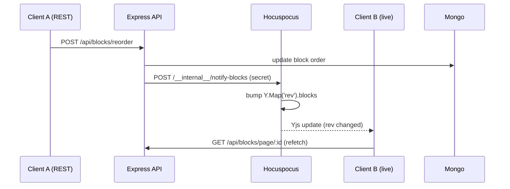

# 06 — Realtime / Collaboration

**This project uses realtime collaboration.** Stack: **Yjs (CRDT) + Hocuspocus (server) +
`@hocuspocus/provider` + `y-prosemirror` + `y-indexeddb` + `y-protocols` (awareness)** over
**WebSockets**.

---

## 1. Why a CRDT (Yjs)? [Confirmed]

- **Problem:** multiple users editing the same document concurrently. Last-writer-wins would lose
  keystrokes; operational transform (OT) needs a central authority to transform ops.
- **Yjs (a CRDT)** makes concurrent edits **conflict-free by construction** — every replica can
  apply updates in any order and converge to the same state. No server-side transform logic.
- **Bonus:** because state is a mergeable structure, you get **offline editing** for free — apply
  local updates, sync deltas when reconnected.

## 2. Document model [Confirmed]

- **One `Y.Doc` per page**; the Hocuspocus `documentName` **is the pageId** → natural per-page
  room isolation.
- Inside the doc, blocks live in `Y.Doc.getMap('blocks')`, and **each block has its own
  `Y.XmlFragment`** bound to a **per-block ProseMirror `EditorView`** via `ySyncPlugin`.
- A tiny `Y.Map('rev')` is used as a **beacon channel** (see §6).

**Why per-block fragments?** Keeps each CRDT fragment small, matches Notion (inline marks don't
span blocks), and lets the **block tree** stay in React/Zustand/Mongo while only **inline text**
lives in the CRDT.

## 3. Connection lifecycle [Confirmed]

Client (`services/realtime.ts` → `connectPage(pageId)`):
1. Create `Y.Doc`.
2. `new IndexeddbPersistence('notion:page:'+pageId, doc)` — **hydrate from IndexedDB BEFORE the
   socket connects** ⇒ instant open + offline-first.
3. `new HocuspocusProvider({ url, name: pageId, token: () => accessToken })` — the token is a
   **function** so it's re-evaluated on every (re)connect and picks up rotated access tokens.
4. Bind `provider.awareness` for presence.
5. Module-level **ref-counted cache** per pageId; teardown deferred one macrotask (React StrictMode
   double-mount safe).

Server (`server/src/realtime/index.ts`, Hocuspocus):
- `onAuthenticate(data)` runs **per connection/tab**: verify the access JWT (same secret/alg as
  REST) → resolve page → workspace → membership + grants → decide **read-only vs read-write** →
  attach the principal to the connection context. **Throws on failure** (returning would admit the
  connection as a writer). No anonymous access — public shares stay on the REST viewer.

## 4. Rooms / channels [Confirmed]
- Room = page (`documentName = pageId`). Isolation is automatic.
- **Why a separate process/port:** Express handles short request/response; Hocuspocus handles
  long-lived sockets. Separating them lets REST and realtime **scale independently** behind a
  (sticky) load balancer.

## 5. Persistence [Confirmed]

- `onStoreDocument` encodes the Y.Doc and upserts it into **`DocSnapshot`** (`_id = pageId`).
  Refused if the encoded size exceeds **`MAX_SNAPSHOT_BYTES` (5MB)** — the live room keeps serving
  clients, but persistence pauses until the doc shrinks (paste-bomb / OOM defense).
- **`DocHistory`** keeps a **throttled** version archive: at most one row per
  `HISTORY_MIN_INTERVAL_MS` (**60s**) of activity, retaining `HISTORY_RETAIN_COUNT` (**20**) rows.
  Powers the History panel + restore.
- On restart, in-flight in-memory room state is reloaded from the last snapshot.

## 6. Bridging REST mutations to live clients (the `rev` beacon) [Confirmed]

Structural block ops (create/delete/reorder, turn-into) go through **REST → Mongo**, so Hocuspocus'
`onStoreDocument` never fires for them. To notify live editors:
- The API calls the realtime process' internal HTTP endpoint
  `POST /__internal__/notify-blocks` (guarded by `x-internal-secret`).
- The realtime process opens a direct connection to the page's Y.Doc and bumps `Y.Map('rev')`.
- Every connected client observes a Yjs update on `rev` and **refetches its block list** (skipping
  its own origin). On the client this is `useBlocksLiveRefresh` (+ comment/database equivalents).

## 7. Presence / awareness [Confirmed]
- `useLocalAwareness` publishes the local user + caret/selection; peers render via `PresenceBar`
  (avatars), `RemoteCarets` (cursors), and `StatusPill`/`OfflineBanner` for connection state.

## 8. Conflict resolution & ordering [Confirmed]
- **Inline text:** Yjs guarantees convergence; `yUndoPlugin` gives **origin-aware, per-user** undo
  (you undo your edits, not everyone's).
- **Structural:** last-writer-wins via idempotent UUID-keyed upsert; the `rev` beacon reconciles
  views. **[Potential issue]** simultaneous structural + inline edits are two systems — the
  reconciliation is the main correctness risk area (be honest about this).

## 9. Reconnection / offline behavior [Confirmed]
- Provider auto-reconnects; a token refresh **forces** an immediate reconnect (don't wait for the
  backoff timer) so a rotated token is used.
- Offline: edits apply locally to the IndexedDB-backed doc; on reconnect, Yjs syncs the state
  vector and merges deltas. This is the **offline-first** claim on the resume — **verifiable**.

## 10. Scalability & failure scenarios [Confirmed / Improvement]
- **Single realtime instance** today. To scale: a shared backend (Redis / `y-redis` / Hocuspocus
  scaling extension) so any instance can host any room, plus sticky routing by `documentName`.
- **Failure modes:** realtime down ⇒ editor still loads from REST + IndexedDB, live sync paused,
  StatusPill shows disconnected; snapshot > 5MB ⇒ persistence pauses (data still live in memory).

## 11. Realtime interview questions
1. Why Yjs/CRDT over OT? *(no central transform, offline-friendly, converges.)*
2. Why one Y.Doc per page and per-block fragments? *(isolation, small fragments, tree stays in
   React.)*
3. How do REST structural changes reach live clients? *(the `rev` beacon.)*
4. How is a socket authenticated and authorized? *(JWT in `token`, resolve perms, RO/RW, throw on
   fail.)*
5. How does offline editing work and what persists it? *(y-indexeddb hydrate-before-connect.)*
6. What stops a giant paste from OOM-ing the server? *(5MB snapshot cap.)*
7. How would you scale WebSockets to 3 instances? *(shared pub/sub + sticky routing.)*
8. Where can Mongo and the CRDT drift, and how would you fix it? *(reconcile from
   `onStoreDocument`; single source of truth for text.)*
9. How does per-user undo work in a shared doc? *(origin-aware `yUndoPlugin`.)*
10. What happens to a rotated access token mid-session on the socket? *(token function re-eval +
    forced reconnect.)*
