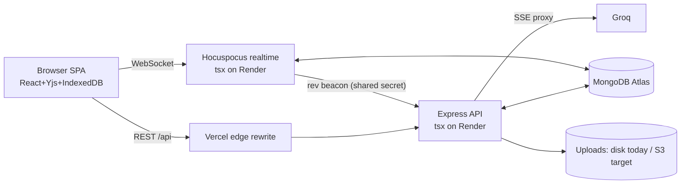

# 17 — System Design

How to present THIS project as a system-design answer, plus how to extend it to "design a
collaborative document editor / Notion." Three timed versions at the end.

---

## 1. Problem framing
"Design a multi-tenant, collaborative, block-based document workspace: nested pages, real-time
multi-user editing with offline support, hierarchical permissions/sharing, search, comments,
notifications, and file uploads."

## 2. Requirements

**Functional:** auth (email + OAuth); workspaces & members; nested pages of blocks; real-time
co-editing + presence; offline editing; permissions + public sharing + invitations; comments +
mentions; search; uploads; (optional) AI assist.

**Non-functional:** low input latency (<100 ms local), conflict-free convergence, durability, tenant
isolation, horizontal scalability of the realtime layer, security (OWASP), graceful degradation when
realtime/AI are down.

## 3. High-level architecture

**Two backend processes:** stateless REST (scales horizontally) + realtime (WS, memory-bound, scales
on connections). They share Mongo and a small internal beacon.

## 4. Data model (see `04`)
Users, Workspaces, Memberships, Pages (tree via `parentId`, denormalized `workspaceId`), Blocks
(normalized, client UUID ids, ordered), Permissions (sparse grants), Comments, Notifications, Tokens
(hashed refresh family), ShareLinks, Invitations, DocHistory (snapshots). Shard key candidate:
`workspaceId`.

## 5. The core design decision: CRDT + DB split
- **Text/inline = Yjs CRDT** (per-page `Y.Doc`, per-block `Y.XmlFragment`): conflict-free, offline
  (y-indexeddb), presence (awareness).
- **Structure/metadata = MongoDB**: queryable for sidebar, search, permissions, exports.
- **Bridge:** realtime persists Yjs state, then emits a `rev` beacon → clients re-pull structure and
  merge **without overwriting locally dirty blocks**; a debounced HTML projection feeds search.
- **Why:** get real-time collaboration **and** a permission-aware, queryable document model. The cost
  is a small, idempotent reconciliation surface.

## 6. Request/edit flows
- **Open page:** REST fetch page + blocks (permission-guarded) → render tree → mount `Y.Doc` →
  IndexedDB hydrate → WS connect → live.
- **Type:** PM update → Yjs delta → broadcast + persist; local autosave (600 ms) upserts structure.
- **Login:** password/OAuth → access JWT (memory, 15 m) + refresh cookie (httpOnly, rotating family).

## 7. Scaling plan (see `10`)
- Stateless REST behind a load balancer.
- Realtime: **sticky routing by documentName** + shared persistence so any node can serve a doc;
  move OAuth state + rate-limit to Redis (remove in-memory single-instance assumptions).
- DB: indexes on `{workspaceId,…}`; shard on `workspaceId`; cache hot page trees.
- Uploads: S3 + CDN (replace ephemeral disk).
- Search: start with Mongo text; graduate to OpenSearch/Elastic at scale.

## 8. Reliability & security
- Degrade gracefully: realtime down → local + last REST snapshot; AI down → feature hidden.
- Durability: Yjs (IndexedDB + server) + idempotent upserts + capped snapshots/history.
- Security: httpOnly rotating refresh w/ reuse detection, in-memory access + `tokenVersion`,
  guards returning 404-not-403, zod validation, helmet/CORS, rate limits, upload re-encoding.

## 9. Bottlenecks & mitigations (name them proactively)
| Bottleneck | Mitigation |
|---|---|
| Realtime memory / WS fan-out | shard by doc, shared persistence, sticky LB |
| In-memory rate-limit & OAuth state | move to Redis |
| Unindexed workspace queries | compound indexes, shard on workspaceId |
| Ephemeral uploads | S3 + CDN |
| No observability | health checks, metrics, error tracking |
| Reconciliation clobber | dirty-aware merge + debounced projection |

## 10. What I'd build next
CI gate + server tests; React Query for server state; S3 uploads; wire virtualization; version-history
UI on top of existing DocHistory; observability.

---

## Timed scripts

**5-minute version:**
> "Multi-tenant collaborative doc editor. React SPA with a per-block ProseMirror editor bound to Yjs
> for conflict-free, offline-capable real-time editing; MongoDB holds the queryable block tree,
> pages, permissions, and users. Two backend processes — a stateless Express REST API and a
> Hocuspocus WebSocket service — scale independently and share Mongo. The key idea is a **source-of-
> truth split**: Yjs owns text, Mongo owns structure, bridged by a tiny internal `rev` beacon.
> Auth is in-memory access JWT + rotating httpOnly refresh with reuse detection; permissions are
> hierarchical with inheritance and 404-on-denial. To scale I'd shard realtime by document, move
> in-memory state to Redis, index/shard Mongo on workspaceId, and move uploads to S3."

**15-minute version:** the 5-min script + walk the architecture diagram + data model + the edit flow
+ the reconciliation mechanism + scaling table.

**30-minute version:** all sections above, with a whiteboard of the CRDT⇄DB bridge, the permission
resolver (inheritance + cache + bulk guard), refresh-token family rotation, and a deep dive on
scaling the realtime tier (sticky hashing, shared persistence, backpressure, presence GC).
